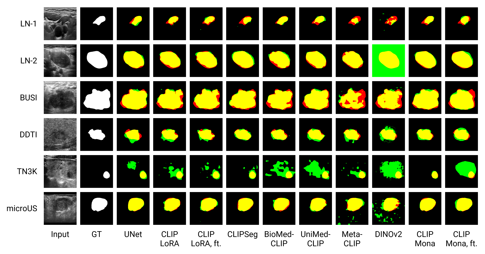

# NextGen-UIA

[[Paper](https://arxiv.org/abs/2506.08849)] [[Datasets](https://github.com/jinggqu/NextGen-UIA/releases)] 

## Results



Visualization of the proposed method and SOTAs on LN-1, LN-2, BUSI, DDTI, TN3K, and Prostate datasets. The first and second columns show the original images and ground truth masks, respectively. Regions in red, green and yellow indicate the ground truth, false positive and true positive, respectively.

## Requirements

All experiments in our paper were conducted on a single Nvidia RTX 4090 GPU with an identical experimental setting. This repository is based on PyTorch 2.7.0, CUDA 12.6 and Python 3.11.11. PyTorch can be installed by following the [official instructions](https://pytorch.org/get-started/locally/). Other dependencies can be installed by:

```bash
pip install -r requirements.txt
```

## Prerequisites

The pre-trained CLIP model and variants should be placed in the current `ckpt` directory, please refer to [ckpt/README.md](ckpt/README.md) for more details. 

The datasets should be placed in the upper-level directory `data`, the overall folder structure should look like this:

```
root-folder
├── source-code
│   ├── ckpt
│   ├── models
│   ├── scripts
│   ├── requirements.txt
│   └── ...
└── data
    └── NextGen-UIA
        ├── all
        │   ├── images
        │   └── masks
        ├── classification
        │   ├── BUSI
        │   │   ├── test.txt
        │   │   ├── train.txt
        │   │   └── val.txt
        │   ├── LN-1
        │   └── LN-2
        ├── finetune
        │   ├── images
        │   ├── us_caption_train_qwen3_8b.jsonl
        │   └── us_caption_val_qwen3_8b.jsonl
        └── segmentation
            ├── BUSI
            ├── DDTI
            ├── LN-1
            ├── LN-2
            ├── TN3K
            └── Prostate
```

Due to collaboration agreement, we cannot provide the two lymph node datasets (LN-1 and LN-2) currently. We're actively working to make these two datasets available to the public. Please stay tuned for more updates.

Other datasets are available in the [Releases](https://github.com/jinggqu/NextGen-UIA/releases) of this repository.

## Training and Evaluation

The training and evaluation scripts are provided in `scripts/clip_mona.sh`. Step-by-step instructions are as follows:

### Fine-tuning

```bash
python clip_finetune.py --caption_type refined
mv runs/clip_mona_finetune/refined.pth ckpt/clip_mona_finetune_refined.pth
```

### Zero-shot Classification

Using the finetuned weights to perform zero-shot classification:

```bash
python clip_cls_zero_shot.py --caption_type refined --finetuned_weights ckpt/clip_mona_finetune_refined.pth --dataset LN-1
```

Using the vanilla CLIP model to perform zero-shot classification:

```bash
python clip_cls_zero_shot.py --dataset LN-1
```

### Supervised Segmentation

Using the finetuned weights to perform supervised segmentation:

```bash
python clip_seg.py --caption_type refined --finetuned_weights ckpt/clip_mona_finetune_refined.pth --dataset LN-1
```

Using the vanilla CLIP model to perform supervised segmentation:

```bash
python clip_seg.py --dataset LN-1
```

### Supervised Classification

Using the finetuned weights to perform supervised classification:

```bash
python clip_cls.py --caption_type refined --finetuned_weights ckpt/clip_mona_finetune_refined.pth --dataset LN-1
```

Using the vanilla CLIP model to perform supervised classification:

```bash
python clip_cls.py --dataset LN-1
```

## Citation

If you find this project helpful, please consider citing:

```bibtex
@misc{qu2025adapting,
      title={Adapting Vision-Language Foundation Model for Next Generation Medical Ultrasound Image Analysis}, 
      author={Jingguo Qu and Xinyang Han and Tonghuan Xiao and Jia Ai and Juan Wu and Tong Zhao and Jing Qin and Ann Dorothy King and Winnie Chiu-Wing Chu and Jing Cai and Michael Tin-Cheung Ying},
      year={2025},
      eprint={2506.08849},
      archivePrefix={arXiv},
      primaryClass={cs.CV},
      url={https://arxiv.org/abs/2506.08849}, 
}
```

## Acknowledgements

Our code is partially based on [CLIPSeg](https://github.com/timojl/clipseg). Thanks for these authors for their valuable work.
