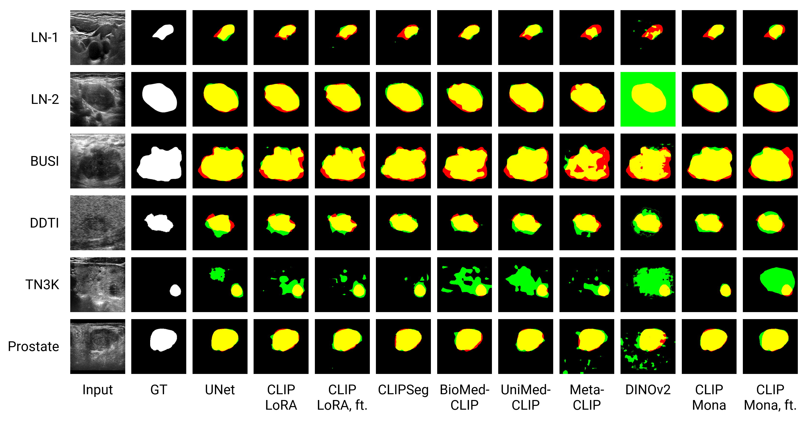

# NextGen-UIA

[[Paper](https://arxiv.org/abs/2506.08849)] [[Datasets](https://github.com/jinggqu/NextGen-UIA/releases)]

## Overview

This repository provides a comprehensive framework for medical ultrasound image analysis using vision-language foundation models. It supports multiple CLIP variants and baseline models with parameter-efficient fine-tuning adapters.




**Supported Models:**
- CLIP Variants: OpenAI CLIP, BiomedCLIP, MetaCLIP, UniMed-CLIP
- Segmentation: CLIPSeg
- Vision Models: DINOv2
- Baselines: ResNet, UNet

**Supported Tasks:**
- Fine-tuning with Mona/LoRA adapters
- Zero-shot classification
- Few-shot classification and segmentation
- Supervised classification
- Supervised segmentation

## Installation

### Requirements

- Python >= 3.12
- PyTorch 2.9.0
- CUDA 12.8+

### Setup

```bash
# Clone repository
git clone https://github.com/jinggqu/NextGen-UIA.git
cd NextGen-UIA

# Install with uv (recommended)
uv sync

# Or install with pip
pip install -e .
```

### Data Preparation

Datasets should be placed in `../data/NextGen-UIA/`:

```
data/NextGen-UIA/
├── all/
│   ├── images/              # All images (shared across tasks)
│   └── masks/               # All masks (shared across tasks)
├── classification/
│   ├── BUSI/                # Breast ultrasound
│   │   ├── labels.csv       # Image -> label mapping
│   │   ├── train.txt        # Training split
│   │   ├── val.txt          # Validation split
│   │   └── test.txt         # Test split
│   ├── LN-INT/              # Lymph node (internal dataset)
│   └── LN-EXT/              # Lymph node (external dataset)
├── finetune/
│   ├── medpix_dataset/      # Optional: MedPix dataset
│   └── pmc_curd_dataset/    # Optional: PMC-CURD dataset
└── segmentation/
    ├── BUSI/                # Breast ultrasound
    │   ├── train.txt        # Training split
    │   ├── val.txt          # Validation split
    │   └── test.txt         # Test split
    ├── LN-INT/              # Lymph node (internal dataset)
    ├── LN-EXT/              # Lymph node (external dataset)
    ├── DDTI/                # Thyroid nodule
    ├── TN3K/                # Thyroid nodule
    └── Prostate/            # Prostate

Note: 
- Each dataset folder contains .txt files listing image names for train/val/test splits
- Classification datasets also include labels.csv mapping images to class labels
```

Due to collaboration agreement, we cannot provide the two lymph node datasets (LN-INT and LN-EXT). Other datasets are available in the [Releases](https://github.com/jinggqu/NextGen-UIA/releases/tag/0.1) of this repository.

### Pretrained Models

Some models are automatically downloaded from HuggingFace (BiomedCLIP, MetaCLIP, CLIPSeg).
Others need to be manually downloaded to `ckpt/`. See [ckpt/README.md](ckpt/README.md) for details.

## Usage

### Running Individual Scripts

```bash
# Fine-tune BiomedCLIP with Mona adapter
python -m src.models.biomedclip.finetune --exp my_experiment --epochs 100

# Zero-shot classification
python -m src.models.biomedclip.zero_shot --dataset BUSI

# Supervised classification
python -m src.models.biomedclip.classification --dataset BUSI --epochs 200

# Supervised segmentation
python -m src.models.biomedclip.segmentation --dataset BUSI --epochs 200

# Few-shot classification (1%, 2%, 5%, 10%, 20%, 50% data)
python -m src.models.biomedclip.fewshot_classification --dataset BUSI --ratio 0.05

# Few-shot segmentation
python -m src.models.biomedclip.fewshot_segmentation --dataset BUSI --ratio 0.10
```

### Running Experiment Scripts

```bash
# Run BiomedCLIP experiments
bash scripts/biomedclip.sh

# Run baseline experiments
bash scripts/baselines.sh
```

## Citation

```bibtex
@article{qu2025adapting,
  title={Adapting vision-language foundation model for next generation medical ultrasound image analysis},
  author={Jingguo Qu, Xinyang Han, Jia Ai, Juan Wu, Tong Zhao, Tonghuan Xiao, Sheng Ning, Yuqi Yang, Jing Qin, Ann Dorothy King, Winnie Chiu-Wing Chu, Jing Cai, and Michael Tin-Cheung Ying},
  journal={arXiv preprint arXiv:2506.08849},
  year={2025}
}
```

## Acknowledgements

Based on [CLIPSeg](https://github.com/timojl/clipseg), [OpenCLIP](https://github.com/mlfoundations/open_clip), and [DINOv2](https://github.com/facebookresearch/dinov2).
